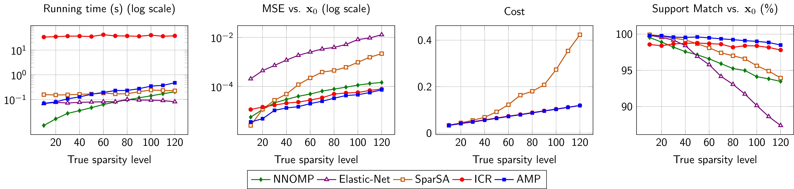
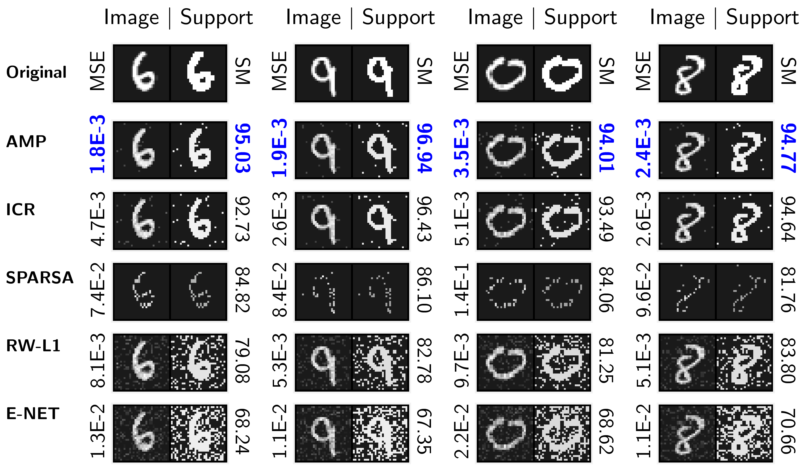
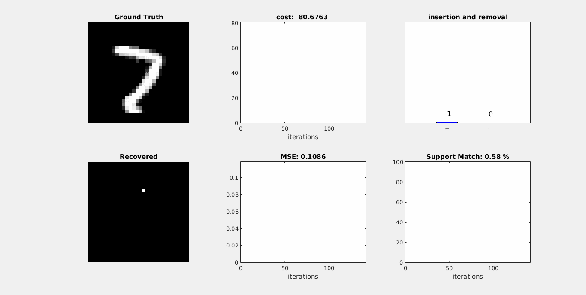

# Demo code for Adaptive Matching Pursuit 
**Paper:**

Tiep H. Vu, Hojjat S. Mousavi, Vishal Monga, " Adaptive matcing pursuit for sparse signal recovery. " IEEE on International Conference on Acoustics, Speech, and Signal Processing (ICASSP), 2017. [(pdf)](https://arxiv.org/pdf/1610.08495.pdf). **Finalist for the Best Student Paper Award**.

**[[Project page]](http://signal.ee.psu.edu/AMP.html)**

# Demo 

Run file `sparse_recovery_demo_pos1.m`.

# Selected Experimental Results 

## Simulated data 
We perform one experiment with sparse data that is naturally non-negative and vary the sparsity level of x_0 from 10 to 120 and compare the running time, MSE, optimal cost function and SM of different methods. Results are shown in Figure below. Similar trends can be seen in this figure where AMP requires less running time than ICR does while it consistently outperforms others in the remaining aspects. It is worth to mention that AMP and ICR obtain almost the identical cost which is better than what SpaRSA achieves.

Note: dictionary size: 512 x 256. 

## Image recovery

Visulization:

